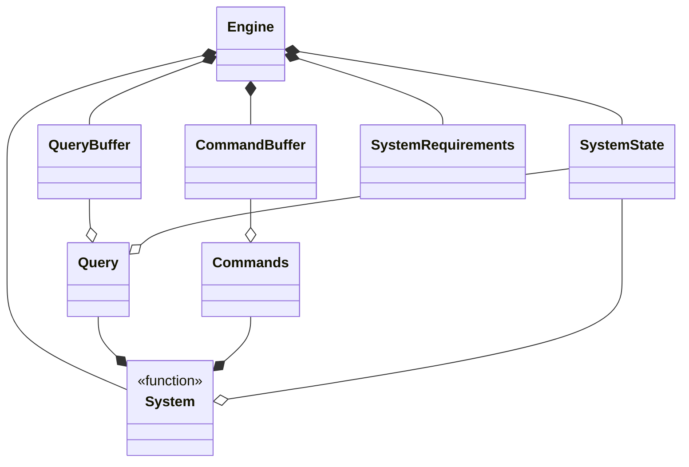

```mermaid
classDiagram

class Engine {
    
}

class CommandBuffer {
    
}

class SystemState {
    
}

class System {
    <<function>>
}

Engine *-- CommandBuffer
Engine *-- SystemState
Engine *-- System
Engine *-- QueryBuffer

class Query {
    
}

class Commands {
    
}

class SystemRequirements

Query --* System

QueryBuffer --o Query

SystemState --o Query

CommandBuffer --o Commands

Commands --* System

SystemState --o System

Engine *-- SystemRequirements

```