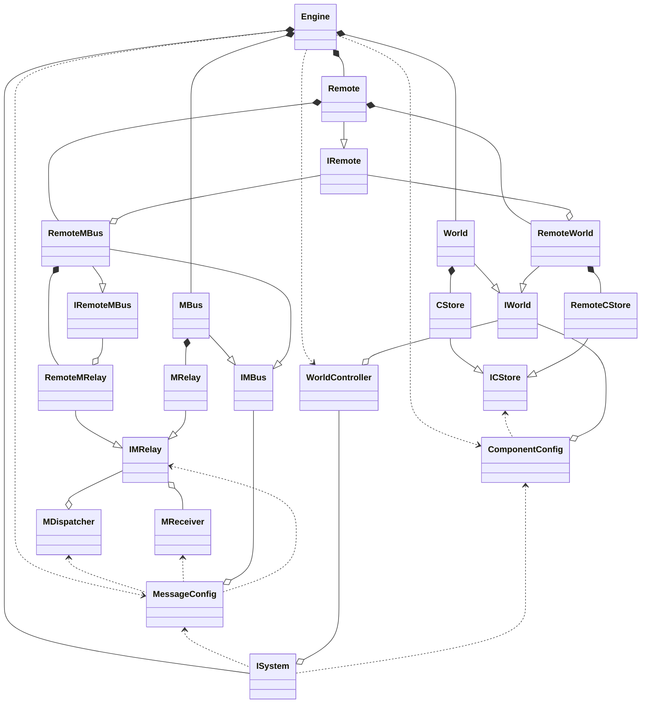

```mermaid
classDiagram

Engine *-- ISystem
Engine *-- Remote
Engine *-- World
Engine ..> MessageConfig
Engine *-- MBus
Engine ..> WorldController
Engine ..> ComponentConfig


RemoteMRelay --|> IMRelay

Remote *-- RemoteWorld

MDispatcher <.. MessageConfig
MReceiver <.. MessageConfig

Remote --|> IRemote
MRelay --|> IMRelay

IMRelay --o MDispatcher
IMRelay o-- MReceiver


IMBus --o MessageConfig

MessageConfig <.. ISystem
IMRelay <.. MessageConfig

CStore --|> ICStore
RemoteCStore --|> ICStore

World *-- CStore

World --|> IWorld
RemoteWorld --|> IWorld

RemoteWorld *-- RemoteCStore

WorldController --o ISystem
IWorld --o WorldController

RemoteMBus *-- RemoteMRelay 
RemoteMBus --|> IRemoteMBus 
IRemoteMBus --o RemoteMRelay

MBus --|> IMBus
RemoteMBus --|> IMBus

Remote *-- RemoteMBus

MBus *-- MRelay

IRemote --o RemoteMBus

IRemote --o RemoteWorld 


ICStore <.. ComponentConfig
ComponentConfig <.. ISystem
IWorld --o ComponentConfig
```